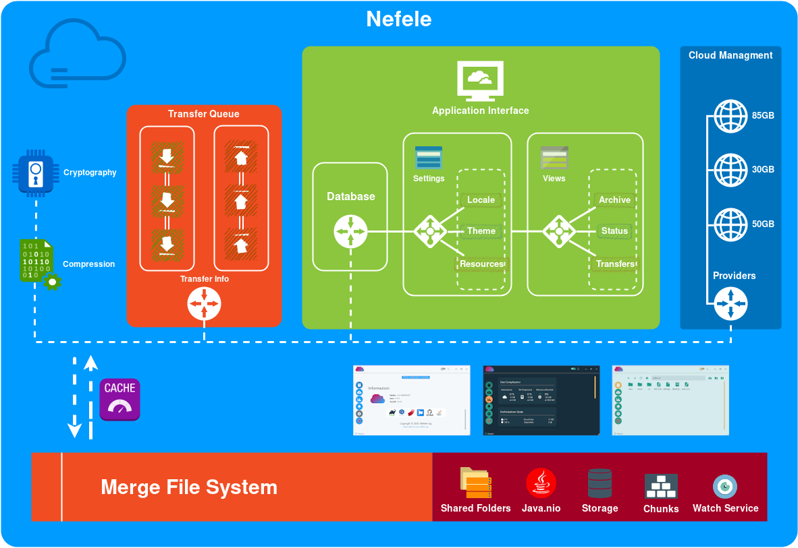

# Nefele

[](https://travis-ci.com/nefele-org/nefele-desktop)
[](https://lgtm.com/projects/g/nefele-org/nefele-desktop/alerts/)
[](https://lgtm.com/projects/g/nefele-org/nefele-desktop/context:java)
[](/LICENSE)

## Descrizione :it:
Nefele è un software open-source per la gestione di un servizio cloud virtuale sicuro, trasparente e flessibile.
Effettua un tecnica di merging dei cloud-service più popolari, applicando crittografia end-to-end e compressione dei dati,
in modo chè gli stessi, appaiano e siano utilizzabili nell'applicazione come se fossero un unico volume di memorizzazione online.
Lo scopo di Nefele è, quindi, quello di gestire e ampliare i propri spazi di memoria cloud attraverso il seguente processo:

* ##### Sezionamento dei dati
    I File vengono suddivisi in *Chunk*, ovvero segmenti di dati, pronti ad essere elaborati e distribuiti.
    
* ##### Distribuzione dei Chunk
    Dispone in modo bilanciato, il carico di spazio disponibile, attraverso un processo di allocazione dei chunk, al fine di garantire
    un partizionamento equo dei cloud.
    
* ##### Memorizzazione
    Infine, tiene traccia **offline** dei nodi che compongono lo spazio di archivizione, rendendo il sistema anonimo e sicuro.


 

#### Features

 * ##### Merge File System
    Componente principale di Nefele, implementa l'infrastruttura di *java.nio*, 
    rappresentando ad un certo livello di astrazione
    il filesystem virtuale che gestisce, come fosse un unico spazio di archivizione, tutti i diversi cloud disponibili.
    
 * ##### Transfer Queue
    Si occupa della gestione dei trasferimenti in ingresso e in uscita dei chunk. Offre, all'utente, la possibilità di
    gestire il numero contemporaneo di download/upload, di visualizzare lo stato e controllarne il flusso.
 
 * ##### Sincronizzazione delle cartelle
    Permette all'utente di sincronizzare bidirezionalmente una cartella di sistema sul proprio nefele-cloud e viceversa.
    
 * ##### Gestione dei Drive
    Aggiungi, modifica o rimuovi i cloud utente, attraverso una procedura guidata.
    
 * ##### Crittografia
    Abilita la crittografia end-to-end sui *chunk*, ovvero una sistema di comunicazione cifrata per la protezione dei dati sensibili.
    
 * ##### Compressione
    Abilita la compressione dei dati, al fine di risparmiare spazio di archivizione online.
    
 * ##### Cache
    Fornisce un sistema di caching, per un accesso rapido alle risorse già elaborate.
  

   
#### User interface

* ##### Temi

* ##### Dark Mode

* ##### Supporto multi-lingua

* ##### Supporto barra di sistema
    
    
 

## Build

To run Nefele, execute the following command:
```shell script
gradlew run --console=rich
```


**NOTE:** Building from sources requires **JDK 11.0.x**, you can download and unzip it from [OpenJDK Archive](https://jdk.java.net/archive/):
 * [Windows](https://download.java.net/java/GA/jdk11/9/GPL/openjdk-11.0.2_windows-x64_bin.zip)
 * [Mac](https://download.java.net/java/GA/jdk11/9/GPL/openjdk-11.0.2_osx-x64_bin.tar.gz)
 * [Linux](https://download.java.net/java/GA/jdk11/9/GPL/openjdk-11.0.2_linux-x64_bin.tar.gz)

You need to set JAVA_HOME environment variable to point to your Java 11 directory, before running Gradle Wrapper.
```shell script
export JAVA_HOME=/path_to_jdk_11
```

## License

Copyright (c) Nefele-org. All rights reserved.

Licensed under the [MIT](/LICENSE) license.

